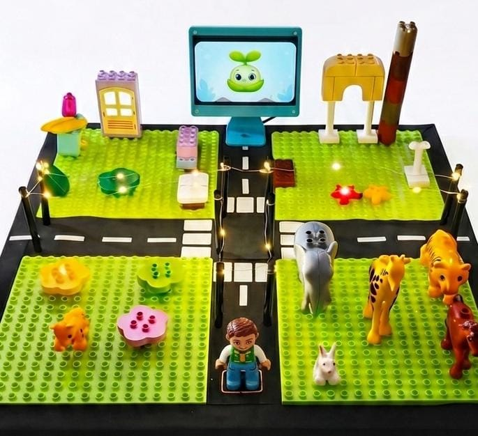
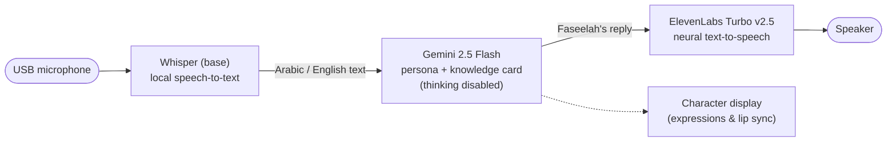

# Al-Faseelah Smart Toy

The complete smart toy behind **Al-Faseelah World** (عالم الفسيلة) — an AI-powered tangible educational toy for children aged 4–9, developed as a Computer Engineering graduation project at **Birzeit University** (July 2026).

This repository contains everything that runs *inside* the physical toy: the custom hardware integration (RFID child login, reed-switch piece sensing, interchangeable play boards) and the full AI voice system on a Raspberry Pi 5 — local speech recognition, a persona-guided language model, neural text-to-speech, a behavior-coaching engine, and session reporting to the parent companion app.

<p align="center">
  
  <br>
  <em>The assembled Al-Faseelah World prototype: themed play zones and magnetic play pieces around Faseelah's screen.</em>
</p>

## The Al-Faseelah World Project

Al-Faseelah World combines physical play, adaptive AI dialogue, simple visual support, and parent-guided learning. Through themed play zones and 23 interactive pieces, the character **Faseelah** — a friendly little plant — talks with the child in Arabic or English, teaching language, Islamic and moral values, good manners, and positive daily behaviors in a natural, playful way. Parents set goals from a companion app, and the toy gently weaves them into play.

**This repo is one of three parts — the rest of the project lives in these repositories:**

| Repository | Role |
|---|---|
| **Al-Faseelah-Smart-Toy** (this repo) | The toy itself: hardware integration + the full AI voice system on the Raspberry Pi |
| [Al-Faseelah-Character-Display](https://github.com/FatimaAzazmah/Al-Faseelah-Character-Display) | Faseelah's animated on-screen face (Pygame) — developed and documented in detail separately |
| [Parent Companion App (Pearant)](https://github.com/FatimaAzazmah/Parent_App_Al-Faseelah_World_Graduation_Project) | Flutter app where parents set behavior goals, pick content, and read session reports |

The toy and the app never talk to each other directly — they meet in a shared **Supabase (PostgreSQL)** database: the parent sets goals and preferences from the app, the toy reads them at session start and writes back a full activity report when play ends.

## The Physical Toy (Hardware)

Al-Faseelah World is not an app — it is a **physical play board** with a Raspberry Pi 5 hidden underneath. The board holds LEGO-compatible themed zones (Home, Mosque, and School, plus one interchangeable slot) connected by roads, with Faseelah's screen rising at the center. Every play piece — furniture, animals, figures — is a physical object the child picks up and places.

### Components

| Component | Role |
|---|---|
| Raspberry Pi 5 (Raspberry Pi OS 64-bit) | Runs the entire AI system inside the toy |
| RDM6300 125 kHz RFID reader | Identifies the child's personal figure at login |
| Reed switches (one per piece slot) | Detect which play piece the child places, and where |
| Magnets embedded in the play pieces | Trigger the reed switch under each slot |
| USB PnP microphone | Captures the child's speech for local transcription |
| Bluetooth speaker | Faseelah's voice |
| 800×480 display | Faseelah's animated face (expressions, blinking, lip sync) |

### Piece sensing — reed switches and magnets

Each of the reed sensors sits **under the play board**, wired between a GPIO pin and ground using the Raspberry Pi's internal pull-up resistors, with all sensor grounds sharing a common rail to keep the wiring manageable. A small magnet embedded in each play piece closes the switch when the piece is placed on its slot; software debouncing filters out the brief electrical noise a magnetic switch produces, and a re-touch window stops one placement from firing twice ([sensor_controller.py](sensor_controller.py)).

**The pin-mapping problem:** with 20+ nearly identical wires running under the board, knowing which sensor ended up on which GPIO pin was the main practical challenge. It was solved with a custom **interactive pin-mapping tool** ([tools/pin_mapper.py](tools/pin_mapper.py) and friends in `tools/`): the tool watches all GPIO pins at once — the builder touches a sensor with a magnet, the tool announces which pin fired, the builder names the piece, and the verified pin-to-piece map is saved and pushed to the database automatically. An error-prone manual task became a reliable few-minute procedure.

### Interchangeable boards — dynamic pin sharing

The toy has two swap-in boards, the **Zoo** and the **Careers city**, that occupy the same physical slots — so the five sensors in that area are *shared* between two different sets of pieces. The parent selects the active board from the app; at run time the toy reads that choice from the database and interprets a touch on those shared pins as the Zoo piece or the Careers piece accordingly. One set of wiring serves two play zones with zero extra hardware.

### RFID child login

The child logs in by placing their personal figure (carrying an RFID tag) on the reader. The RDM6300 communicates over UART (`/dev/ttyAMA0`); its data line runs at **5 V** while the Pi's pins expect **3.3 V**, so a simple voltage divider on the reader's TX line brings the level down safely. The driver ([rfid_reader.py](rfid_reader.py)) validates each frame's XOR checksum and debounces repeated reads, then hands the tag id to the software to load the matching child profile from the database.

### Audio on a busy Pi

Recording uses `arecord` in its own OS process rather than an in-process audio library — PortAudio would intermittently hang when called from a background thread while Pygame's event loop owned the main thread. Shelling out to ALSA sidesteps the conflict entirely (see the notes in [main_ai.py](main_ai.py)).

## The Cascaded AI Pipeline

The voice loop is a deliberate **cascade of three independent stages** rather than an end-to-end voice model:



Why cascaded instead of Gemini's live voice mode or ElevenLabs' conversational agent:

- **Voice identity** — Faseelah keeps one specific, warm, child-friendly voice in each language (Habibah for Arabic, Lulu for English), independent of the language model.
- **Safety and inspection** — every exchange passes through text, so it can be logged, constrained by the engineered child-safe persona, and audited.
- **Privacy** — speech-to-text runs **locally** on the Pi with Whisper; the child's raw voice never leaves the device.
- **Modularity** — any stage can be swapped (e.g., a local LLM can later replace Gemini) without touching the rest.

### Measured latency (on the Raspberry Pi 5)

| Stage | Result |
|---|---|
| Speech recognition (Whisper *base*) | 0.8–1.5 s (measured) |
| Language model (Gemini 2.5 Flash, thinking disabled) | 0.4–0.8 s (measured) |
| Text-to-speech (ElevenLabs Turbo) | 0.6–1.2 s (estimated) |
| **Full interaction cycle** | **~2.0–3.5 s** |

Two measured decisions got it there: switching Whisper *small* → *base* (~2× faster transcription) and disabling Gemini's extended thinking mode (~3× faster responses) with no noticeable quality drop for short child-friendly exchanges. Early prototypes used **Vosk** for keyword-style recognition (see `tests/test_vosk.py`); it was replaced by full Whisper transcription for natural, unconstrained speech.

## How a Session Works

1. **Boot** — Faseelah is asleep on screen; the system waits for an RFID tag.
2. **Child login** — the child places their personal figure on the RFID reader; the child's profile, interests, active behavior goal, and parent-saved content load from Supabase.
3. **Warm onboarding** — Faseelah wakes, greets the child by name with a salaam, asks about their day, and has a short natural check-in before inviting them to play. The child leads: grabbing a piece early or going quiet ends the check-in gracefully.
4. **Physical play** — the reed switches detect each piece the child places. Every piece has a rich bilingual **knowledge card** (facts in three difficulty levels, vocabulary, values, play ideas, open questions) that grounds the Gemini conversation — with anti-repetition tracking so Faseelah never recycles the same fact in a session.
5. **Behavior coaching** — if the parent set a goal (free text like "I want him to tidy his room"), Gemini classifies it against a 10-behavior catalog, a hidden coaching strategy is woven into the system prompt (nudging, never lecturing), and success signals in the child's speech advance the goal — with a celebration when it completes.
6. **Parent report** — every engaged piece is recorded and the session (activities, zones, stars, duration) is persisted to Supabase incrementally, where the parent app displays it.

## Repository Structure

```
├── main_ai.py             # Main entry point — the full live AI session
├── main_integrated.py     # Legacy app-connected mode (BLE + zone dialogues)
├── dialogue_manager.py    # speak() / listen() helpers: ElevenLabs + gTTS fallback, Whisper STT
├── behavior_engine.py     # Behavior goal classification, coaching injection, success detection
├── content_manager.py     # Supabase bridge: knowledge cards, stories, sessions, saved content
├── prompts.py             # Faseelah's engineered child-safe persona and task templates
├── story_flow.py          # Story variety / offer-timing module (planned integration)
├── character_display.py   # Faseelah's animated face (see the Character Display repo)
├── sensor_controller.py   # Reed-switch sensing + live child-location tracking
├── rfid_reader.py         # RDM6300 RFID reader (UART) with checksum + debounce
├── ble_server.py          # BLE GATT server bridging the parent app to shared state
├── config.py              # Central config — all secrets come from .env
├── run.sh                 # Launcher for the app-connected mode
├── images/                # Character expression frames
├── docs/                  # Photos of the assembled toy
├── tools/                 # Hardware bring-up: pin mapping, sensor & RFID verification
└── tests/                 # Pipeline experiments: STT/TTS/LLM benchmarks, full-session tests
```

## Getting Started

### Prerequisites

```bash
sudo apt install python3-venv portaudio19-dev alsa-utils mpg123
```

### Install

```bash
git clone https://github.com/FatimaAzazmah/Al-Faseelah-Smart-Toy-Graduation-Project.git
cd Al-Faseelah-Smart-Toy-Graduation-Project
python3 -m venv venv
source venv/bin/activate
pip install -r requirements.txt
```

Whisper downloads its *base* model (~140 MB) automatically on first run. The optional Vosk experiments in `tests/` need the Arabic model [`vosk-model-ar-mgb2-0.4`](https://alphacephei.com/vosk/models) (~318 MB, not included in this repo).

### Configure

```bash
cp .env.example .env
```

Fill in your Gemini, ElevenLabs, and Supabase credentials (see the comments in `.env.example`). The database schema (children, pieces, zones, content, sessions, behavior goals…) is shared with the [parent app](https://github.com/FatimaAzazmah/Parent_App_Al-Faseelah_World_Graduation_Project).

### Run

```bash
# The full AI experience (Arabic or English)
python3 main_ai.py --lang ar
python3 main_ai.py --lang en

# App-connected mode: BLE server + integrated display loop
./run.sh
```

Individual stages can be tested from the repository root, e.g.:

```bash
python3 tests/test_gemini.py          # LLM connectivity + persona
python3 tests/test_voice_pipeline.py  # Gemini -> ElevenLabs timing
python3 tests/test_voice_chat.py      # full mic -> Whisper -> Gemini -> speaker loop
```

## Authors

**Fatima Azazmah and Rawaa Hammad**

Graduation project supervised by **Dr. Hanna Balata** — Electrical and Computer Engineering Department, Birzeit University, July 2026.
